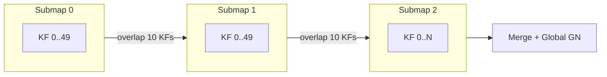

# Submapping Architecture for MASt3R-SLAM

## Problem

After ~50 keyframes, GPU memory overloads. The keyframe buffer (X, C, feat, pos, img — ~10-15 MB per KF on GPU) plus inference temporaries push past VRAM limits.

## Approach

Split the sequence into **submaps** of ~50 keyframes each, with an **overlap** of ~10 keyframes between consecutive submaps. After the full sequence is processed, **stitch** submaps and run a **final global optimization** over the merged factor graph.




### Per-submap lifecycle

1. **Seed** the submap: either from INIT (submap 0) or from the last `overlap` keyframes of the previous submap
2. **Run** the normal SLAM loop until `len(keyframes) >= max_kf_per_submap`
3. **Finalize**: run one last backend optimization pass on the current graph
4. **Archive**: save all edge data (already on CPU) and keyframe data (poses, X, C, feat, pos, img) to a `SubmapResult` struct — copy KF tensors to CPU
5. **Extract overlap**: keep the last `overlap` keyframes' data for seeding the next submap
6. **Reset**: clear keyframe buffer, factor graph, retrieval DB, tracker, states
7. **Seed next**: write overlap KFs into slots 0..overlap-1, set `n_size = overlap`, add them to retrieval DB, set mode = TRACKING, continue from the next unprocessed frame

### Final global merge and optimization

After all frames are processed:

1. **Free the MASt3R model** (not needed for optimization, reclaims ~2.7 GB)
2. **Build a global keyframe buffer** on GPU (total unique KFs across all submaps)
3. **Remap and merge** all submap edge tensors using the offset formula: `global_idx = submap_start[s] + local_idx`, where `submap_start[s] = s * (max_kf - overlap)`
4. **Build a merged FactorGraph** from the concatenated edges
5. **Run `solve_GN_rays`** (or `solve_GN_calib`) on the full merged graph — the solver already uses windowed GPU upload, so it can iterate over the full graph in windows
6. **Save** the globally-optimized trajectory and reconstruction

## What to reset between submaps


| Component           | Reset action                                                                                   |
| ------------------- | ---------------------------------------------------------------------------------------------- |
| `SharedKeyframes`   | `n_size = 0`, then write overlap KFs into slots 0..overlap-1, set `n_size = overlap`           |
| `FactorGraph`       | Clear all `_*_cpu` tensors (new empty tensors)                                                 |
| `RetrievalDatabase` | `ivf_builder = asmk.create_ivf_builder()`, `kf_counter = 0`, `kf_ids = []`, re-add overlap KFs |
| `FrameTracker`      | `reset_idx_f2k()`                                                                              |
| `SharedStates`      | `set_mode(TRACKING)`, clear `global_optimizer_tasks`, clear `edges_ii/jj`, `reloc_sem = 0`     |


## New module: `mast3r_slam/submapping.py`

Key classes/functions:

- `**SubmapResult`** — dataclass storing archived data for one submap:
  - `submap_id`, `start_frame_idx`, `end_frame_idx`
  - `T_WCs` (all keyframe poses, CPU)
  - `Xs`, `Cs` (point clouds, CPU)
  - `feats`, `positions` (MASt3R features, CPU)
  - `imgs` (keyframe images, CPU)
  - `dataset_idxs` (frame indices into the dataset)
  - `edge_data` (dict of CPU tensors: ii, jj, idx_ii2jj, etc.)
  - `n_keyframes`
- `**archive_submap(keyframes, factor_graph, submap_id, ...)`** — copies current GPU state to a SubmapResult on CPU
- `**extract_overlap(keyframes, overlap)**` — returns the last `overlap` keyframes' data as CPU tensors
- `**reset_pipeline(keyframes, factor_graph, retrieval_database, tracker, states)**` — clears all state
- `**seed_from_overlap(keyframes, states, retrieval_database, overlap_data)**` — writes overlap KFs into the fresh buffer and re-registers them
- `**merge_submaps(submap_results, max_kf, overlap)**` — builds global keyframe buffer + merged factor graph
- `**run_global_optimization(merged_keyframes, merged_factor_graph, n_iters)**` — runs GN solver on the full merged graph

## Config additions (`config/base.yaml`)

```yaml
submap:
  enabled: false
  max_kf: 50         # keyframes per submap before starting a new one
  overlap: 10         # carry-over keyframes between consecutive submaps
  final_opt_iters: 20 # GN iterations for the final global optimization
```

## CLI addition (`SCRIPT_MAIN_Pipeline.py`)

- `--submaps` flag to enable submapping (overrides `submap.enabled` in config)
- The main loop (`step_11`) gets an outer submap loop when enabled

## Pipeline changes in `SCRIPT_MAIN_Pipeline.py`

- `step_11_run_slam_loop` gains an optional submap wrapper: outer loop creates submaps, inner loop runs frames
- New `step_11b_global_optimization` after step 11 when submapping is active
- `step_12_save_results` uses the globally-optimized keyframes when submapping

## Files changed

- **New**: `[mast3r_slam/submapping.py](mast3r_slam/submapping.py)` — all submapping logic
- **Edit**: `[SCRIPT_MAIN_Pipeline.py](SCRIPT_MAIN_Pipeline.py)` — `--submaps` flag, submap loop, global optimization step
- **Edit**: `[config/base.yaml](config/base.yaml)` — `submap:` section
- **Edit**: `[mast3r_slam/frame.py](mast3r_slam/frame.py)` — add `SharedKeyframes.reset()` helper
- **Edit**: `[mast3r_slam/global_opt.py](mast3r_slam/global_opt.py)` — add `FactorGraph.reset()` and `FactorGraph.load_edges()` helpers
- **Edit**: `[mast3r_slam/retrieval_database.py](mast3r_slam/retrieval_database.py)` — add `RetrievalDatabase.reset()` method
- **Edit**: `[USAGE_GUIDE.md](USAGE_GUIDE.md)` — document submapping

